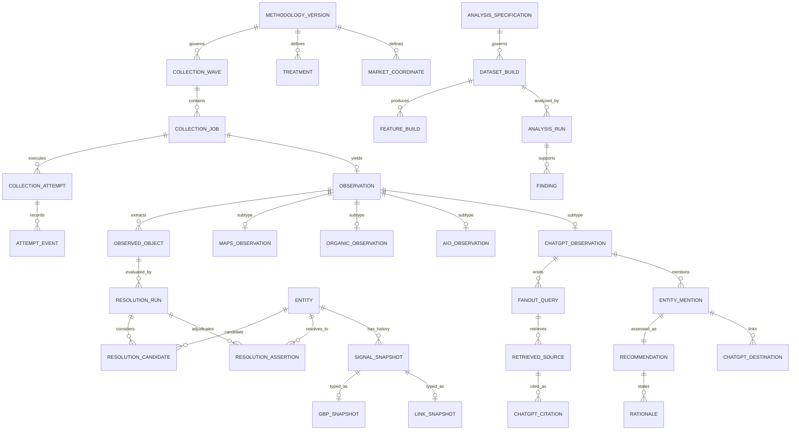

# SED Local Search Intelligence Platform
## Physical Supabase/Postgres Schema Contract v0.1

**Date:** 2026-09-09  
**Status:** Implementation-ready draft aligned to the authoritative handoff through Section 35  
**Companion migration:** `SED_Physical_Supabase_Postgres_Schema_v0_1.sql`

---

## 1. Purpose

This contract turns the approved conceptual research architecture into a physical PostgreSQL/Supabase design.

It is intentionally stricter than an ordinary analytics database. The database must preserve the scientific provenance of a longitudinal research system in which:

- raw provider observations are immutable evidence;
- normalized extraction is separate from raw evidence;
- canonical entity resolution is separate, versioned, and correctable without rewriting history;
- Maps, Organic, AIO, ChatGPT, Top-50 evidence, and enrichment share one canonical entity/signal system;
- changing signals are temporal histories rather than destructively overwritten “current values”;
- costs are attributable to the calls/economic units that caused them;
- derived datasets and findings are rebuildable from versioned inputs;
- structural missingness, technical failure, non-observation, and measured zero are distinct.

This contract does **not** authorize any change to the research universe, geometry, cadence, query/prompt wording, result depth, replicate count, enrichment eligibility, or epistemic rules.

---

## 2. Physical namespace layout

| Schema | Responsibility |
|---|---|
| `manifest` | Frozen/versioned definition of what should be collected |
| `ops` | Waves, jobs, attempts, raw payloads, observations, QA, cost accounting |
| `core` | Shared canonical entity graph and versioned resolution |
| `maps` | Maps/Local Pack normalized surface evidence |
| `organic` | Organic SERP normalized surface evidence |
| `aio` | AIO/AI Mode presentation/source/citation/business/destination evidence |
| `chatgpt` | ChatGPT response/fanout/source/citation/mention/recommendation/destination evidence |
| `enrichment` | Shared temporal explanatory-variable histories and freshness |
| `research` | Analysis contracts, datasets, features, cohorts, analyses, models, findings |
| `client` | Client Mode references to shared research truth |

No child surface owns a duplicate canonical business table, duplicate signal warehouse, duplicate cost ledger, or duplicate finding registry.

---

## 3. ID strategy

### 3.1 Internal primary keys

Use UUID primary keys for durable database identity:

- `methodology_version_id`
- `wave_id`
- `job_id`
- `observation_id`
- `entity_id`
- `observed_object_id`
- `resolution_assertion_id`
- `signal_snapshot_id`
- `dataset_build_id`
- `analysis_run_id`
- `finding_id`

The SQL uses `gen_random_uuid()`.

### 3.2 Human-readable/versioned codes

UUIDs are accompanied by stable codes where operators need them:

- `methodology_code`
- `industry_code`
- `market_code`
- `surface_code`
- `geometry_code`
- `treatment_code`
- `wave_code`
- `job_key`
- `spec_code`
- `dataset_code`
- `finding_code`

### 3.3 External identifiers are not PKs

Google Place IDs, CIDs, DataForSEO task IDs, domains, URLs, review IDs, social handles, and provider object IDs are stored as external identifiers or attributes. They do not become the platform’s universal primary key.

This is necessary because provider identifiers may be absent, duplicated across grains, replaced, merged, or discovered later.

---

## 4. Methodology and manifest versioning

`manifest.methodology_version` is the top-level collection contract version.

A methodology version points to versioned membership/configuration through:

```text
methodology_version
├── methodology_industry
├── methodology_market
├── geometry_version
│   ├── geometry_point
│   └── market_coordinate
├── treatment
│   └── surface_treatment
├── provider_profile
├── surface_config
└── panel_subset
    ├── panel_subset_industry
    └── panel_subset_market
```

### Freeze rule

A frozen methodology version is never silently edited to change scientific collection behavior.

Changes to any of the following require a new version or a deliberately versioned amendment:

- industry membership;
- market membership;
- exact query/prompt template;
- surface membership;
- coordinate geometry;
- water eligibility;
- collection cadence;
- result depth;
- replicate count;
- provider behavior that changes the observation;
- permanent exclusions.

The database contains a `manifest_sha256` and artifact URI so the exact machine-readable manifest can be tied to a methodology version.

---

## 5. Treatment model

The physical schema deliberately distinguishes **treatment set** from **treatment code**.

Example treatment sets may include:

```text
google_core
aio
chatgpt
```

This matters because the same industry can legitimately have:

- Google core Q1–Q4;
- AIO C01–C10;
- ChatGPT C01–C10.

The uniqueness boundary is therefore:

```text
methodology_version
+ industry
+ treatment_set
+ sequence
```

not merely `industry + sequence`.

`surface_treatment` then states which treatment applies to which surface. Maps and Organic may reference the same Google-core treatment definitions without duplicating literal text.

---

## 6. Market coordinate model

Coordinates are normalized into three layers.

### 6.1 `geometry_version`

Defines the geometry as a methodology object.

Examples:

- Maps/Organic 13-point pilot geometry;
- AIO 9-point geometry.

### 6.2 `geometry_point`

Defines the abstract point:

```text
C
N1 E1 S1 W1
N3 E3 S3 W3
N5 E5 S5 W5
```

or AIO equivalents.

It stores:

- bearing;
- distance;
- ordinal;
- full-geometry membership;
- nested-candidate membership;
- incremental-point membership.

### 6.3 `market_coordinate`

Stores the actual WGS84 point for a market plus structural-water eligibility.

Controlled eligibility:

```text
pending
eligible_land
structural_water_exclusion
manual_review
configuration_failure
```

A structural exclusion retains:

- intended coordinate;
- exclusion reason;
- water feature name;
- MTFCC;
- feature ID;
- water-mask source/version.

It is not deleted and is never encoded as rank/visibility zero.

---

## 7. Wave, job, attempt, observation: four different objects

These four levels must never be collapsed.

```text
collection_wave
    ↓
collection_job
    ↓
collection_attempt
    ↓
observation
```

### 7.1 Wave

A `collection_wave` is the operational research interval:

- monthly Full Panel;
- weekly Sentinel;
- pilot;
- validation;
- explicitly approved ad hoc work.

Wave status is evented in `ops.wave_event`.

### 7.2 Job

A `collection_job` is **one deterministic planned scientific collection unit**.

Examples:

```text
Maps × Plumbing × Los Angeles × Q3 × N3 × replicate 1
ChatGPT × Urgent Care × Miami × C04 × no coordinate × replicate 2
```

A job stores the exact rendered query/prompt and rendered request payload.

### 7.3 Deterministic job key

`job_key` is a SHA-256 idempotency key over the scientific identity of the planned run.

Recommended canonical serialization:

```text
methodology_code
wave_code
surface_code
industry_code
market_code
treatment_set
treatment_code
coordinate_code_or_NONE
replicate_no
```

The serialized representation must itself be versioned in the job-generator contract.

A duplicate retry cannot create a second scientific job.

### 7.4 Attempt

An attempt is a technical provider execution.

A job may have multiple attempts because of:

- HTTP/network failure;
- provider task failure;
- timeout;
- retryable provider error.

Attempts do **not** represent independent scientific replicates.

Attempt state is append-only in `collection_attempt_event`.

### 7.5 Observation

There is at most one terminal scientific `ops.observation` per `collection_job`.

The database enforces `unique(job_id)`.

If ChatGPT returns a refusal, clarification, or no local recommendations, that is still the scientific result for the job. It is not replaced to obtain a “successful” recommendation.

The FK `(accepted_attempt_id, job_id)` ensures an observation cannot accidentally claim an attempt from a different job.

---

## 8. Raw payload retention

Raw evidence uses two layers.

### `ops.raw_blob`

Content-addressed immutable bytes:

```text
sha256
storage_bucket
storage_path
byte_size
mime_type
content_encoding
```

### `ops.provider_payload`

One observed provider payload occurrence:

```text
provider
blob
payload_kind
provider_task_id
captured_at
metadata
```

Recommended private Supabase Storage layout:

```text
research-raw/
  {methodology_code}/
    {wave_code}/
      {surface_code}/
        {job_id}/
          {attempt_id}/
            request.json.gz
            task_post_response.json.gz
            task_get_response.json.gz
            rendered_response.*
```

The raw blob is content-addressed; the payload occurrence preserves context/provenance.

A normalized table is never a substitute for the retained provider payload.

---

## 9. Three evidence layers

The architecture must physically preserve:

### Layer 1 — immutable raw

`ops.raw_blob`  
`ops.provider_payload`

### Layer 2 — normalized extraction

`ops.observation`  
`core.observed_object`  
surface-specific normalized tables

### Layer 3 — derived research

`research.dataset_build`  
`research.feature_build`  
`research.analysis_run`  
`research.finding`

A parser correction creates a new parser/versioned derivation. It does not overwrite Layer 1.

---

## 10. Canonical entity model

### 10.1 Shared supertype

Every canonical thing receives `core.entity.entity_id`.

Controlled entity types include:

- organization;
- brand;
- business location/service operation;
- Google Business Profile;
- domain;
- URL;
- directory profile;
- review profile;
- social profile;
- booking destination;
- publisher/source;
- source asset;
- other.

Subtype tables add structurally useful fields without creating separate truth systems.

### 10.2 Assets are not businesses

Domains, URLs, profiles, booking pages, and source assets remain entities/assets related to businesses.

They are not silently flattened into a `business` row.

### 10.3 Relationship graph

`core.entity_relationship_assertion` models relationships such as:

```text
business_location → operated_by → organization
business_location → member_of → brand
business_location → franchisee_of → brand
google_business_profile → gbp_for → business_location
domain → domain_for → organization/business
url → url_for → business/domain
profile → profile_for → entity
```

Assertions belong to an `entity_graph_release`.

---

## 11. Observed objects are not canonical entities

`core.observed_object` is a normalized representation of what a provider actually surfaced.

It may contain:

- raw name;
- raw URL/domain;
- raw phone;
- raw address;
- raw text span;
- raw provider IDs;
- other provider attributes.

It intentionally has its own ID.

The correct chain is:

```text
surface result/mention
→ observed_object
→ resolution_run
→ candidate entities
→ resolution_assertion
→ canonical entity, if justified
```

A raw Maps result or ChatGPT mention is never given a canonical entity ID just because its name resembles an existing business.

---

## 12. Versioned resolution

Resolution is append-only.

### `core.entity_graph_release`

A reproducible release/version of the canonical graph used for an analysis.

### `core.resolution_run`

Stores:

- observed object;
- graph release;
- resolver version;
- resolver stage;
- input hash.

### `core.resolution_candidate`

Preserves the candidate set and evidence, including:

- candidate rank;
- match score;
- score semantics;
- supporting evidence;
- conflicting evidence.

`match_score` is not called a probability unless it is calibrated as one.

### `core.resolution_assertion`

Controlled states:

```text
resolved
probable_match
ambiguous
unresolved
likely_nonexistent
insufficient_information
```

Resolved/probable assertions require an entity ID.

Other states require `resolved_entity_id IS NULL`.

A later correction inserts a new assertion and points `supersedes_assertion_id` at the prior assertion.

### Historical versus latest identity

`core.latest_resolution` is a convenience view.

Historical analyses must still retain the graph/release and assertion versions they originally used. The view must never erase the historical resolver state.

---

## 13. Maps physical model

```text
ops.observation
    ↓ 1:1
maps.observation
    ↓ 1:N
maps.result
    ↓ optional
core.observed_object
```

`maps.result` preserves:

- returned sequence;
- absolute rank;
- rank group;
- title/category;
- rating/review count;
- raw address/phone;
- returned coordinates;
- URL;
- provider fields.

The retained result record is immutable.

Top-3/Top-10 presence, coverage, DAVS, effective radius, transition states, and similar constructs are derived later.

---

## 14. Organic physical model

```text
ops.observation
    ↓
organic.observation
    ↓
organic.result
```

Each result preserves:

- absolute rank;
- page and within-page position where available;
- result type;
- title;
- snippet;
- raw URL/domain;
- normalized observed URL object.

Organic surfacing by itself does not create a special canonical-business truth and does not silently bypass the approved enrichment gate.

---

## 15. AIO / AI Mode physical model

The schema preserves presentation and evidence as separate objects:

```text
aio.observation
├── presentation_unit
├── business_appearance
│   └── destination
└── source_occurrence
    └── citation
        └── evidence_link
```

### Important semantic separation

A source may be:

- retrieved;
- presented;
- cited;
- supportive of a business;
- supportive of a claim;
- general background.

Those are not synonyms.

`aio.evidence_link` records support relationships without converting them into causal/ranking-factor claims.

---

## 16. ChatGPT physical model

The required observable chain is represented explicitly:

```text
manifest.treatment
    ↓
ops.collection_job
    ↓
chatgpt.observation
    ↓
chatgpt.fanout_query
    ↓
chatgpt.retrieved_source
    ↓
chatgpt.citation
    ↓
chatgpt.evidence_link

chatgpt.observation
    ↓
chatgpt.entity_mention
    ↓
chatgpt.recommendation
    ↓
chatgpt.rationale
    ↓
chatgpt.destination
```

These branches can link through `chatgpt.evidence_link`.

### Fanout provenance

`origin` is controlled as:

```text
observed
derived_inferred
```

Only `observed` fanout belongs to the primary observed-fanout dataset.

### Recommendation state

Every identified mention should receive one recommendation assessment during normalized classification.

`recommendation_strength` preserves the approved ordinal scale:

```text
0 = not recommended
1 = weak
2 = standard
3 = strong
4 = top choice
```

The SQL requires:

- `recommended=false` → strength `0`;
- `recommended=true` → strength `1..4`.

Shortlist membership and top choice remain distinct.

### Rationale categories

The schema controls the initial approved rationale categories independently from research claims.

A rationale is what ChatGPT stated. It is not proof of why the system selected a business.

---

## 17. Shared enrichment model

The database does not create one “latest business metrics” row that is overwritten forever.

All changing signals flow through:

```text
enrichment.signal_type
    ↓
enrichment.freshness_policy
    ↓
enrichment.enrichment_request
    ↓
enrichment.enrichment_run
    ↓
enrichment.signal_snapshot
```

Typed history tables then extend a generic snapshot.

### Typed histories

V0.1 includes:

- `business_identity_snapshot`
- `gbp_snapshot`
- `review_state_snapshot`
- `review`
- `website_site_snapshot`
- `website_page_version`
- `link_snapshot`
- `brand_demand_snapshot`
- `social_profile_snapshot`
- `source_content_version`

### Cache/freshness semantics

A cached value reused because it is still scientifically fresh points to the earlier snapshot.

It must **not** insert a fake new snapshot with a new `observed_at`.

`enrichment.latest_signal_snapshot` is only a convenience view.

---

## 18. Website/content-addressed processing

Website/page evidence preserves:

- raw blob;
- content hash;
- rendered-text hash;
- structured-data hash;
- canonical URL;
- HTTP status;
- ETag;
- Last-Modified;
- parser version;
- extraction;
- first seen;
- last checked;
- last changed.

When content is unchanged, prior expensive classifications/embeddings may be reused.

A content hash is not used to erase the temporal fact that the URL was checked again.

---

## 19. Review history

Individual review bodies are append-only.

Identity strategy:

1. use stable provider review ID when available;
2. otherwise use robust content hash + business + temporal context.

The schema contains separate partial uniqueness paths for provider IDs and hash-based fallback.

A review count increase should allow incremental new-review collection without repurchasing the full historical corpus.

---

## 20. Cost ledger

### Provider price history

`ops.provider_price_version` records versioned provider pricing by product/endpoint and billing unit. A price change inserts a new effective-dated row rather than overwriting the prior planning/observed price. `ops.cost_event` can reference the price version used for drift checks.


### 20.1 `ops.cost_event`

Every paid call/event can record:

- provider;
- wave;
- job;
- attempt;
- economic-unit entity;
- purpose;
- billing unit;
- billed units;
- amount;
- provider reference;
- timestamp.

### 20.2 Monetary precision

The physical amount is stored as integer **micro-USD**:

```text
$0.0012 → 1,200 microusd
$1.00   → 1,000,000 microusd
```

This avoids binary floating-point money errors and supports very cheap API calls.

### 20.3 `ops.cost_allocation`

One paid event may be allocated across multiple jobs/entities when necessary.

This supports:

- batching;
- cross-surface reuse;
- shared enrichment;
- marginal cost analysis for the 13-vs-9 pilot;
- actual cache/dedup savings.

---

## 21. Shared embeddings

The platform's content-addressed embedding requirement is physicalized in `enrichment.embedding`.

Each row keys an embedding to:

- canonical entity and/or observed object;
- source `content_sha256`;
- exact embedding model/component version;
- embedding dimension;
- stored vector;
- optional source-content URI.

The migration enables `pgvector` but intentionally creates **no approximate-nearest-neighbor index yet**. ANN indexing should be chosen only after the embedding model/dimension and measured query pattern are stable. Deterministic parsing and ordinary SQL remain preferred before vector/LLM work when sufficient.

---

## 22. ChatGPT product-event registry

`chatgpt.product_event` stores observed/known structural product changes that may affect comparability.

It records:

- event time;
- product;
- event type;
- description;
- source/evidence;
- comparability impact;
- methodology-version association.

This lets an analysis flag a same-wave or longitudinal comparison as structurally noncomparable without rewriting observations.

---

## 23. Top-50 evidence storage

The shared Brand + Service + Location Top-50 evidence layer should **reuse the Organic normalized result model** rather than create a second organic SERP schema.

Its `manifest.surface.surface_code` is `google_top50`, its result depth is 50, and its exact treatment is the canonical Brand + Service + Location query. The job still enters `ops.collection_job`; the normalized result set enters `organic.observation` / `organic.result`.

This gives one consistent Google-organic result representation while retaining a distinct surface code and purpose.

---

## 24. Missingness model

Do not represent all absence as NULL and hope analysts infer the cause.

The full system distinguishes at least:

- structural water exclusion;
- configuration failure;
- provider failure;
- parser failure;
- terminal collection error;
- unobserved surface;
- stale signal;
- unknown signal;
- unresolved identity;
- legitimate measured zero;
- legitimate observed negative.

The physical representation is intentionally distributed across the object that owns the state:

| Meaning | Physical location |
|---|---|
| structural water | `manifest.market_coordinate.eligibility` |
| provider/collection failure | attempt/job events + `ops.observation_state` |
| parser failure | `ops.observation_state` / QA event |
| unresolved identity | `core.resolution_assertion` |
| stale enrichment | `enrichment.signal_snapshot.freshness_state` |
| missing surface observation | absence from eligible jobs/observations, interpreted against manifest/wave |
| measured zero | typed numeric value `0` |
| observed negative | explicit surface result/outcome flag |

A structural exclusion never creates a zero rank.

---

## 25. Reproducible derived datasets

The system must never rely on a permanent flattened “everything table.”

Instead:

```text
normalized observations
+ graph release
+ signal histories
+ Analysis Specification Contract
→ dataset_build
→ feature_build
→ analysis_run
→ finding
```

### `research.analysis_specification`

Physically stores the required scientific contract:

- population;
- estimand;
- exposure;
- confounders;
- mediator/collider treatment;
- timing/lags;
- missingness;
- repeated measures;
- multiple testing;
- validation/holdout;
- practical effect requirements;
- code provenance.

### `research.dataset_build`

Records:

- methodology version;
- entity-graph release;
- analysis spec;
- source observation cutoff;
- parser/resolver version bundle;
- SQL component version;
- build config;
- input manifest URI/hash;
- output artifact URI/hash;
- row count.

### `research.feature_value`

Typed value columns are mutually exclusive. Exactly one of numeric/boolean/text/jsonb/timestamp is populated.

### `research.finding`

Every finding states its evidentiary mode:

```text
descriptive
associational
predictive
causal
```

A predictive model cannot be stored as a causal finding merely because it predicts well.

---

## 26. Client Mode

Client Mode does not copy research signals.

`client.case_record` references the shared canonical entity, industry, and market.

`client.assessment` references research findings and emits only the allowed decision family:

```text
TEST
MONITOR
LEAVE_ALONE
insufficient_evidence
ineligible
```

Client observations and competitive gaps remain separate JSON objects from research findings.

---

## 27. Immutability policy

The SQL installs an `ops.reject_update_delete()` trigger on core evidence/history tables.

Protected classes include:

- raw blobs;
- provider payloads;
- deterministic collection jobs;
- scientific observations;
- normalized observed objects;
- Maps/Organic/AIO/ChatGPT surface evidence;
- resolution runs/candidates/assertions;
- entity relationship assertions;
- external-ID assertions;
- aliases;
- temporal signal snapshots;
- reviews;
- page/source content versions;
- cost events/allocations.

Corrections are represented by:

- a new parser version;
- new normalized output;
- a new resolver run/assertion;
- a new graph release;
- a new enrichment snapshot;
- a new dataset build;
- a superseding finding.

Not by overwriting historical evidence.

---

## 28. Operational state is evented

`ops.wave_event`, `ops.job_event`, and `ops.collection_attempt_event` preserve state transitions.

Operational acceptance itself is versioned through:

- `ops.qa_contract_version`
- `ops.qa_rule`

Every threshold/rule set therefore has an explicit version and artifact hash. `ops.qa_event` can point to the exact rule that fired, and `ops.wave_evaluation` records which QA-contract version judged the wave. QA thresholds must never be retrofitted after seeing outcomes.


Rebuildable convenience views:

- `ops.current_wave_state`
- `ops.current_job_state`

This avoids making a mutable `status` column the only surviving operational history.

---

## 29. Indexing strategy

### B-tree

Used for:

- wave/surface;
- market/industry;
- treatment/coordinate;
- entity/time;
- resolution lookup;
- result rank;
- cost attribution;
- cohort membership.

### BRIN

Used on large append-oriented timestamps:

- `ops.observation.observed_at`
- `enrichment.signal_snapshot.observed_at`

This is appropriate for chronological append-heavy history.

### Trigram

`pg_trgm` indexes support inexpensive candidate-generation search over observed/canonical aliases without treating fuzzy similarity as truth.

### JSONB

V0.1 intentionally does **not** GIN-index every JSONB field.

Provider/raw metadata is retained, but JSONB indexes should be added only when actual query telemetry shows a repeated analytical need. Indiscriminate GIN indexing would increase write/storage cost without scientific benefit.

---

## 30. Partitioning decision

### V0.1 recommendation: do not partition immediately

The platform begins around:

- 280,000 Full Panel jobs/month before water exclusions;
- plus Sentinel;
- plus result child rows.

This is large but well within ordinary PostgreSQL scale with correct indexes.

Premature declarative partitioning would complicate:

- primary/unique constraints;
- cross-table FKs;
- Supabase tooling;
- migrations;
- entity-resolution joins.

Therefore V0.1 keeps the principal tables unpartitioned and stores appropriate timestamps/wave IDs.

### Revisit partitioning from telemetry

Consider monthly/time partitioning for the largest append-only child tables only if measured evidence shows:

- index bloat;
- vacuum pressure;
- unacceptable query latency;
- retention-management need;
- materially faster pruning.

Partitioning is an engineering optimization, not a methodology change, provided observation identity/provenance remain intact.

---

## 31. Supabase Storage contract

Recommended private buckets:

```text
research-raw
research-derived
research-models
research-exports
```

### `research-raw`

Immutable provider responses and other raw evidence.

### `research-derived`

Rebuildable large datasets/features/results.

### `research-models`

Versioned statistical/ML artifacts.

### `research-exports`

Human/operator exports that are not themselves source of truth.

Do not depend on the mutable presence of a UI export for reproducibility. Database rows retain URI + SHA-256.

---

## 32. Supabase security boundary

This schema migration intentionally does not create user-facing RLS rules because application/user roles have not been specified by the research methodology.

Before any of these schemas are exposed through Supabase APIs:

1. revoke broad `anon`/`authenticated` access;
2. define service roles;
3. create least-privilege RLS/security-definer API functions where required;
4. keep raw payload buckets private;
5. prohibit client-side direct mutation of research evidence.

Security policy is an application/deployment contract, not a research-methodology decision.

---

## 33. Retention and deletion

Scientific raw observations, normalized raw surface evidence, resolution history, signal histories, and cost history are retained indefinitely by default for the longitudinal research program.

Do not implement ordinary cascading deletion from canonical entities into historical surface evidence.

Where privacy/legal requirements require removal, the deletion procedure must:

- record the legal/operational reason;
- preserve non-sensitive provenance where lawful;
- invalidate dependent derived datasets;
- rebuild downstream artifacts if necessary.

The current SQL uses only narrow cascades for manifest subset-membership convenience, not scientific evidence.

---

## 34. High-level ER diagram



---

## 35. Table inventory

### Manifest

1. `manifest.methodology_version`
2. `manifest.surface`
3. `manifest.industry`
4. `manifest.market`
5. `manifest.methodology_industry`
6. `manifest.methodology_market`
7. `manifest.geometry_version`
8. `manifest.geometry_point`
9. `manifest.market_coordinate`
10. `manifest.treatment`
11. `manifest.surface_treatment`
12. `manifest.provider_profile`
13. `manifest.surface_config`
14. `manifest.panel_subset`
15. `manifest.panel_subset_industry`
16. `manifest.panel_subset_market`

### Operations

17. `ops.provider`
18. `ops.provider_price_version`
19. `ops.component_version`
20. `ops.collection_wave`
21. `ops.wave_event`
22. `ops.collection_job`
23. `ops.job_event`
24. `ops.raw_blob`
25. `ops.provider_payload`
26. `ops.collection_attempt`
27. `ops.collection_attempt_event`
28. `ops.observation`
29. `ops.cost_event`
30. `ops.cost_allocation`
31. `ops.qa_contract_version`
32. `ops.qa_rule`
33. `ops.qa_event`
34. `ops.wave_evaluation`

### Core entity graph

35. `core.entity_type`
36. `core.entity`
37. `core.organization`
38. `core.brand`
39. `core.business_location`
40. `core.google_business_profile`
41. `core.web_domain`
42. `core.web_url`
43. `core.profile_entity`
44. `core.source_asset`
45. `core.relationship_type`
46. `core.observed_object`
47. `core.entity_graph_release`
48. `core.resolution_run`
49. `core.resolution_candidate`
50. `core.resolution_assertion`
51. `core.entity_relationship_assertion`
52. `core.external_identifier`
53. `core.external_identifier_assertion`
54. `core.entity_alias_assertion`

### Surface evidence

55. `maps.observation`
56. `maps.result`
57. `organic.observation`
58. `organic.result`
59. `aio.observation`
60. `aio.presentation_unit`
61. `aio.business_appearance`
62. `aio.source_occurrence`
63. `aio.citation`
64. `aio.destination`
65. `aio.evidence_link`
66. `chatgpt.observation`
67. `chatgpt.product_event`
68. `chatgpt.fanout_query`
69. `chatgpt.retrieved_source`
70. `chatgpt.citation`
71. `chatgpt.entity_mention`
72. `chatgpt.recommendation`
73. `chatgpt.rationale`
74. `chatgpt.destination`
75. `chatgpt.evidence_link`

### Enrichment

76. `enrichment.signal_type`
77. `enrichment.freshness_policy`
78. `enrichment.enrichment_request`
79. `enrichment.enrichment_run`
80. `enrichment.signal_snapshot`
81. `enrichment.business_identity_snapshot`
82. `enrichment.gbp_snapshot`
83. `enrichment.review_state_snapshot`
84. `enrichment.review`
85. `enrichment.website_site_snapshot`
86. `enrichment.website_page_version`
87. `enrichment.link_snapshot`
88. `enrichment.brand_demand_snapshot`
89. `enrichment.social_profile_snapshot`
90. `enrichment.source_content_version`
91. `enrichment.embedding`

### Research/client

92. `research.analysis_specification`
93. `research.dataset_build`
94. `research.feature_definition`
95. `research.feature_build`
96. `research.feature_value`
97. `research.cohort`
98. `research.cohort_member`
99. `research.model_version`
100. `research.analysis_run`
101. `research.hypothesis`
102. `research.finding`
103. `research.finding_evidence`
104. `client.case_record`
105. `client.assessment`

The schema currently contains **105 physical tables**. The deliberately explicit physical model is preferable to one generic JSON event table because the core research semantics are stable and analytically important.

---

## 36. Migration order

Recommended deployment order:

```text
001_extensions_and_schemas
002_controlled_types
003_provider_component_and_price_registries
004_manifest
005_core_entity_base
006_ops_collection_and_raw
007_core_resolution
008_maps
009_organic
010_aio
011_chatgpt
012_enrichment
013_research
014_client
015_indexes
016_views
017_immutability_triggers
018_seed_lookups
019_manifest_v1_data
020_security_rls_after_app_contract
```

The companion SQL is delivered as one transaction for review. For production migrations, split it at these boundaries.

---

## 37. What belongs in the next QA contract

The schema already provides storage locations for the next artifact, but the thresholds remain intentionally outside this contract.

The Operational QA / Wave Acceptance Contract should define:

- expected vs executable vs returned counts;
- COMPLETE/PARTIAL/FAILED/QUARANTINED thresholds;
- duplicate-job and duplicate-observation rejection;
- water-exclusion checks;
- provider failure limits;
- parser failure limits;
- entity-resolution coverage;
- AIO source/citation capture completeness;
- ChatGPT fanout/source/mention capture completeness;
- enrichment/cache hit telemetry;
- provider-cost anomaly thresholds;
- wave promotion rules.

The physical schema should not invent those thresholds in advance.

---

## 38. Acceptance criteria for this schema contract

The schema contract is implementation-ready when an engineer can answer all of the following without inventing methodology:

1. What uniquely identifies a planned collection?
2. How are retries distinguished from scientific replicates?
3. What is the permanent observation ID?
4. Where are exact raw provider bytes stored?
5. Can a parser correction be applied without overwriting raw history?
6. Can an entity match be corrected later without rewriting the original result?
7. Can one business reuse enrichment across all surfaces?
8. Can cached reuse be distinguished from a fresh observation?
9. Can every paid call be attributed?
10. Can structural water be distinguished from provider failure and measured zero?
11. Can ChatGPT fanout → source → citation → mention/recommendation → destination be reconstructed?
12. Can AIO retrieved/cited/supportive relationships remain distinct?
13. Can a past analysis be rebuilt under the same methodology, resolver, parser, feature, and code versions?
14. Can findings remain explicitly descriptive/associational/predictive/causal?
15. Can Client Mode reference research truth without copying it?
16. Can shared embeddings be reused by exact content/model version without inventing new semantic observations?
17. Can ChatGPT product changes be recorded as structural-break/comparability events without rewriting historical observations?

The v0.1 schema answers **yes** to all seventeen.

---

## 39. Decisions intentionally deferred

These are engineering decisions still safe to defer without changing methodology:

- user-facing RLS/auth role design;
- exact database connection-pool sizing;
- partitioning thresholds;
- vacuum/autovacuum tuning;
- Supabase Storage lifecycle policy;
- backup/PITR service tier;
- whether high-volume derived feature values remain in Postgres or move to Parquet with database manifests;
- materialized views for dashboard performance;
- read replicas.

None of these should be allowed to change the scientific collection or evidence model.

---

## 40. Next step

After review/acceptance of this physical schema contract:

> Build the Operational QA / Wave Acceptance Contract.

The QA contract should use the actual tables and IDs in this schema rather than defining another parallel operational model.
